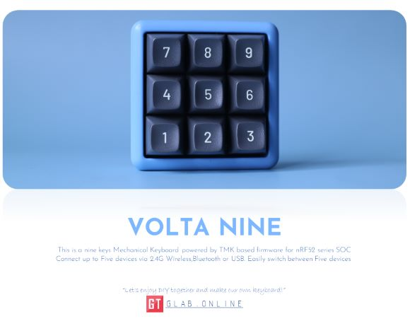

---
hide:
  - navigation # Hide navigation
  - footer
---

近期动态
==========
2022年底收官了
-----------
:octicons-calendar-24: 2022.12.14

离2.4G功能发布已经过了快半年了，工作一直很忙。

终于在最忙碌的年底抽出了时间将今年预定的最后的目标给完成了：

2.4G实现了动态跳频和多接收器切换。

动态跳频功能实现后，2.4G通讯的可靠性有了质的飞跃。

简单直观的对比就是，在未实现前，如果有2个键盘接入同一个接收器工作的话，就会偶尔感受到输出的卡顿。

3个键盘同时接入的话，会有明显的干扰造成频繁的输出卡顿现象，4个键盘的话就会严重影响到输入体验。

而实现动态跳频后，在有5个键盘同时接入的情况下，依然可以保障键盘间无明显的干扰，输入流畅。

同样的道理，在受到其他2.4G无线通讯干扰时，现在我们有了更好的抗干扰性，无线使用体验得到了极大的提升。

至于多接收器切换，也算是很有用的一个功能，通过多个接收器接入不同的电脑，快速切换，

就可以确保一个键盘同时配合两至三台电脑进行工作了。

使用说明已经更新，大家可以参看相关说明，年末了，新功能奉上，祝大家用的开心！！

附上[非正式发布固件下载地址](https://down.glab.online:5550/sdk17/)

2.4G使用指南
-----------
:octicons-calendar-24: 2022.06.22

2.4G接收器开卖在即，让我们先来学习下2.4G使用的一些知识。

**2.4G的一些特性**

1. 一个接收器支持配对7个设备，支持最高7个设备同时在线
2. 一个键盘仅支持配对一个接收器 （暂时）
3. 接收器配对采用开放模式，不需要特别设定，不需要程序干预
4. 与蓝牙、USB可以实现无缝切换

**键盘如何支持2.4G功能**

1. 所有Glab键盘[^1]升级20220624版及以后固件都可支持2.4G功能。已经刷入2.4G测试固件的需要升级新的正式固件
2. 你需要到[淘宝店铺](https://glab.taobao.com)购买一个2.4G无线接收器
3. 将键盘刷写支持2.4G无线功能的固件，从双模固件升级的，刷写时注意勾选"擦除蓝牙芯片"，刷写键盘主控完整固件
4. 刷完固件用<kbd>Lshift</kbd>+<kbd>Rshift</kbd>+<kbd>U</kbd> （或者通过配置工具配置一个无线模式切换按键）切换无线模式
5. 完成2.4G接收器配对即可正常使用2.4G无线功能

**2.4G接收器配对**

1. 将接收器插入电脑USB口通电
2. 按下<kbd>Lshift</kbd>+<kbd>Rshift</kbd>+<kbd>U</kbd> 将键盘切换到2.4G无线模式
3. 键盘未配对：按下<kbd>Lshift</kbd>+<kbd>Rshift</kbd>+<kbd>R</kbd>启动配对通讯，即可配对完成
4. 键盘已配对：按下<kbd>Lshift</kbd>+<kbd>Rshift</kbd>+<kbd>O</kbd>删除配对信息，按下<kbd>Lshift</kbd>+<kbd>Rshift</kbd>+<kbd>R</kbd>启动配对通讯，即可配对到新的接收器
5. 如PAD等小键盘，无<kbd>Lshift</kbd>、<kbd>Rshift</kbd>，可通过配置工具配置<kbd>切换 无线模式</kbd>/<kbd>无线 广播配对</kbd>/<kbd>无线 解除配对</kbd>，启动配对通讯、删除配对信息

**接收器配对满载后如何配对设备**

当7个设备位置绑定完成后，接收器将不再接收配对新设备，如需配对新的设备，需要先重置接收器。

重置接收器，配对新设备方法：

1. 将接收器插入电脑USB口，并使用浏览器[^2]访问[接收器控制面板](/2.4G/index.html)
2. 首次使用需授权：点击 <kbd>授权设备</kbd> 按钮，弹出授权面板，选择设备，点击<kbd>连接</kbd>授权连接接收器
3. 授权成功后，每次插入接收器，访问[接收器控制面板](/2.4G/index.html)会自动连接接收器
4. 点击 <kbd>重置接收器</kbd> 可重置键盘配对索引，重置后建议重新拔插接收器，即可接受新的键盘绑定。
5. 重置后，已经配对的键盘依然可以正常访问，接收器会根据键盘连接情况，重新建立索引。
6. 为避免冲突，重置接收器前，不再配对到接收器的键盘请提前按下双shift+O删除绑定信息，空出索引位置。
7. 配对的键盘重新访问接收器完成配对，或重新配对到接收器。

**接收器如何更新固件**

接收器长期插在电脑USB口上，为避免为键盘刷机时误刷入接收器，接收器默认是不能刷写USB固件和主控固件的。

在刷写固件之前，需要先通过[接收器控制面板](/2.4G/index.html) 启用刷写功能

1. 将接收器插入电脑USB口，并使用浏览器[^2]访问[接收器控制面板](/2.4G/index.html)
2. 首次使用需授权：点击 <kbd>授权设备</kbd> 按钮，弹出授权面板，选择设备，点击<kbd>连接</kbd>授权连接接收器
3. 授权成功后，每次插入接收器，访问[接收器控制面板](/2.4G/index.html)会自动连接接收器
4. 需要刷写USB固件的话，点击<kbd>进入 USB ISP模式</kbd> 按钮，启用USB ISP模式，随后按照键盘刷写USB固件的方法刷写USB固件
5. 需要刷写主控固件的话，点击<kbd>启用CMSIS-DAP</kbd> 按钮，启用CMSIS-DAP刷写功能，随后按照键盘刷写键盘主控固件的方法刷写主控固件
6. 刷写固件后，请重新拔插接收器，以便恢复默认禁止刷写状态

[^1]: 过于老旧的PCB不支持线刷固件，无法升级到最新固件版，需要自行使用Jlink等烧录器通过PCB上SWD接口烧录升级固件
[^2]: 当前支持的浏览器包括chrome 89+ / EDGE 89+ / Opera 75+

2.4G的接收器终于完成了
-----------
:octicons-calendar-24: 2022.06.12

{ align=right width="420"}

2022年已经过去差不多半年了，这半年逐步将PCB重新画图升级到RGB版本，甚至还复活了Newhope64这一款，现在只余下Omega50和Omega64还没有完成，至于Omega84嘛，应该不会制作了。

从2.4G的测试固件发布后，其实为2.4G接收器制造也做了不少准备工作，比如调试修正了USB的致命BUG：卡BIOS。不然上了接收器后，有一部分童鞋的电脑不能正常使用，总不能老是去拔插接收器吧。接着就是元器件选型确认，接收器外壳选型，设计接收器的PCB，期间还需要规划后续的很多东西，比如成本，软件，改进方向等等。然后5月底开始打样准备制造2.4G的接收器，结果整整打样了四次，才算真的完成，都已经不是一波三折了，整成了一波四折😂。说起来还是事情太杂，导致精力不够集中，原理图和封装一再出错。但不管怎么说吧，我还是把它制造出来了👌。

如图，整体体积还是不错的，和优联的大小基本一致，稍微长一点点。

软件方面基本没有改动，延续的测试固件那一套代码，使用上还算是有保证，当然还是缺失了配对功能，多个接收器的话会冲突打架。不过有了硬件，我会逐步更新软件部分的。接下来就是小批量制造售卖的问题了，也是需要好好思考的，我可不希望售出后使用体验被吐槽，坑了用户，当然也不希望亏本😊。

_________________________

2.4G的测试固件可以体验了
-----------
:octicons-calendar-24: 2022.01.22

说了很久的2.4G固件，虽然是还缺配对功能的半成品，但是使用上没啥大问题了。

不切换到2.4G模式与正式稳定版固件基本没有差别，大家可以放心下载测试。

测试步骤：

<b>一、升级键盘固件</B>:

固件下载地址：[Github发布页](https://github.com/genokolar/nrf52-keyboard/releases/) / [官方下载页面](https://down.glab.online:5550/Glab3.1/) 

键盘刷写👆面的固件，刷完固件用Lshift+Rshift+U （或者通过配置工具配置一个无线模式切换按键）切换无线模式。

<b>二、升级接收器固件</B>:

暂时未提供接收器，可使用Volta9刷写接收器固件后，使用Volta9作为接收器(或者PAD)。

如果要将Volta9或者PAD作为接收器，需要刷写专门的接收器固件，刷完固件通过配置工具配置一个无线模式切换按键，切换到2.4G模式，然后插入USB线，它就是一个2.4G接收器了，切换回蓝牙模式，它就是一个正常的键盘。

/// 仅提供Volta9的固件
接收器固件下载： [Volta9](https://down.glab.online:5550/Glab3.1/)

<b>三、如何使用</B>:

键盘与接收器都升级到支持2.4G的固件后，将键盘与接收器都切换到2.4G模式，将接收器插入USB线连接到电脑，就可以正常使用了。

如果不需要2.4G模式，也可以切换成蓝牙模式使用蓝牙，或者插入USB线使用USB。对，它就是一个三模键盘。

_________________________

Volta9 初步完成了
-----------
:octicons-calendar-24: 2021.12.20

{ align=left width="280"}

键盘是越搞越小，这次带来了一个九键的小玩具，今年最后的作品了，属于颜值正义那种。

我个人是很喜欢的，作为小玩具，摆件什么的都挺好。

提供如图的图纸，可以网上打印，价格也不贵。20-30元即可树脂光固化一个外壳。

这玩意能做什么呢？ 我个人定义的是玩具、小夜灯，当然也可以配合全键自定义或宏按键，当一个快捷键小键盘，一键密码输入器。上一个响亮的青轴，当一个减压神器。

_________________________

关于键盘的取名
-----------
:octicons-calendar-24: 2021.12.11

临近年底，大家应该都非常忙吧。今天和大家分享一下我们各款PCB名字的意义。

如果早期关注的人或者去了解一下的人，应该知道，其实我们键盘的命名都是物理上与电相关的单位（或者说科学家的名字）

Farad是电容的单位法拉，以发现电磁感应现象的英国物理学家迈克尔·法拉第（Michael Faraday）的名字而命名

Omega并不是那个名表，而是电阻的单位欧姆（Ohm），是因为德国物理学家乔治·西蒙·欧姆（Georg Simon Ohm）发现了电阻中电流与电压的正比关系，即著名的欧姆定律。欧姆其符号是希腊字母Ω，读作Omega。

接下来我们即将登场一款9键PCB，我们命名为Volta9。那么Volta代表什么呢? 不明白的搜索一下吧。

_________________________

请及时更新配置工具
-----------
:octicons-calendar-24: 2021.11.28

配置工具由于每年都需要更新证书，所以需要大家每年更新一次配置工具。

请于2022年1月13日前将工具更新到1.0.3.0版本。为减少工作量，我们不再提供安装版本。

_________________________

RGB灯效展示
-----------
:octicons-calendar-24: 2021.11.08

我们通过移植QMK的RGB功能，实现了RGB灯效，当前采用的是自带芯片的WS2812灯珠，下面的视频演示了其中部分灯效。

<iframe height=180 width=320 src='https://player.youku.com/embed/XNTgyMDM4MDMzNg==' frameborder=0 'allowfullscreen'></iframe>

由于WS2812的静态耗电非常大，哪怕是Keypress类灯效（只有按键后才会亮灯），耗电也很大。所以在使用电池供电时，请尽量关闭RGB以便节电。需要使用灯效的情况，建议采用USB供电。

_________________________

我们不再使用蓝牙模块
----------
:octicons-calendar-24: 2021.10.18

长久以来我们都采用的蓝牙模块，而不是直接使用nRF52的芯片，我们先后采用过信驰达RF-BM-ND04/Raytac MDBT42Q-512KV2/亿佰特E104-BT5032A。

但是2021年是艰难的一年，芯片价格飞涨，包括CH552与nRF52芯片,而蓝牙模块要么缺货，要么价格涨到无法承受。

换模块，必然需要重新设计PCB板子，最终迫使我们直接采用了nRF52芯片。这样至少不会因为某一款模块缺货就无法生产，也不会因为换模块就必须重新设计PCB，我们只要设计一次PCB，就可以应用在nRF52832/nRF52811/nRF52810三种不同的芯片上。

愿2022年，疫情早日结束，缺芯潮早日结束。

_________________________

基于SDK15.3的版本不再更新
-----------
:octicons-calendar-24: 2021.10.05

现在所有所有PCB都转入了SDK17.1版本固件，基于SDK15.3的版本仅修正BUG，不再引入新功能。

现在新硬件出厂默认都是SDK17.1的固件了，SDK15.3的固件可以直接刷写SDK17.1的完整固件进行升级。

但是遗憾的是最老的一批固件无法通过线刷完整固件升级，要么只能停留在SDK15.3版本，要么购买烧录器（如jlink），然后通过PCB上的SWD接口自行将固件升级到SDK17.1版本。

_________________________

