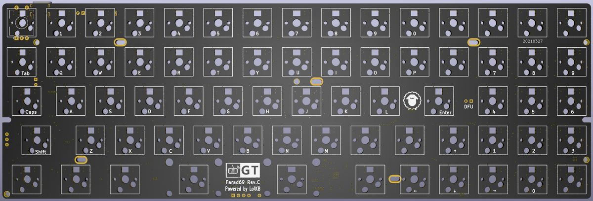

Farad69 REV.C 键盘
=====================
本页面仅描述rev.C版本（轴灯版）相关信息

## 描述

- 5x14的60%键盘，带数字小键盘
- 支持RGB轴灯（无灯效）
- Type-C接口
- 蓝牙主控为nRF52832（Raytac MDBT42Q-512KV2蓝牙模块）
- 采用热拔插方式（佳达隆轴座）
- 支持旋转编码器
- 轴灯兼指示灯功能
- 共引出1个针脚可自行定义
- 预留WS2812 RGB灯带焊接位
- 支持PCB卫星轴
- PCB尺寸：285mm×95.3mm

## 指示灯说明

轴灯分为轴灯模式和指示灯模式，出厂默认为指示灯模式，可通过<kbd>Lshift</kbd>+<kbd>Rshift</kbd>+<kbd>L</kbd> 在指示灯模式和轴灯模式之间切换。

轴灯在指示灯模式时，通过不同的颜色指示状态：

- 蓝色-蓝牙连接成功、蓝牙输出
- 绿色-USB输出
- 粉色-蓝牙通道1️⃣广播中
- 黄色-蓝牙通道2️⃣广播中
- 红色-蓝牙通道3️⃣广播中
- USB连接状态下，状态灯常亮
- 蓝牙连接状态下，指示灯5秒后自动熄灭（可自定义常亮时长）
- 蓝牙广播30秒后未连接自动熄灭。

### RGB轴灯说明

轴灯分为轴灯模式和指示灯模式，出厂默认为指示灯模式，可通过<kbd>Lshift</kbd>+<kbd>Rshift</kbd>+<kbd>L</kbd> 在指示灯模式和轴灯模式之间切换。

当前轴灯版PCB采用蓝牙主控直接驱动RGB灯，所以无复杂灯效，仅有单色常亮、单色呼吸和彩虹循环，可手动调色，可视为单色轴灯的增强版本。

轴灯模式时，采用<kbd>Lshift</kbd>+<kbd>Rshift</kbd>+<kbd>Z</kbd> <kbd>X</kbd> <kbd>C</kbd> <kbd>V</kbd>等RGB控制功能调整轴灯。

## 如何启用旋钮编码器

只需要将旋钮编码器焊接到ESC位置，然后接入配置工具，找到键盘设置--布局配置--编码器选项，将按键更改成编码器。

顶部出现的两颗按钮就是旋转功能，下面第一颗按键，就是旋钮按键功能。

## 固件下载

!!! tip  "本页面提供的蓝牙固件基于nRF SDK17.1    [怎么切换SDK版本？](../faq.md#怎样切换不同SDK版本的固件)"

[:fontawesome-solid-download:  20211105蓝牙完整固件](http://glab.online/down/sdk17/farad69-c-nrf52_all-20211105-11d28f72.hex){ .md-button}

[:fontawesome-solid-tools:  工具等下载](../down/download.md){ .md-button}
