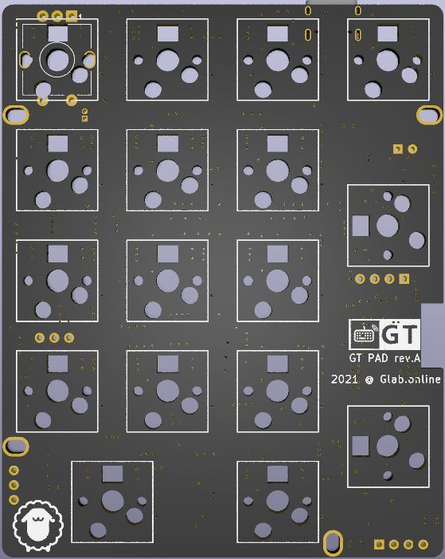
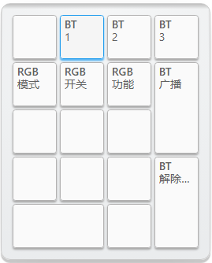
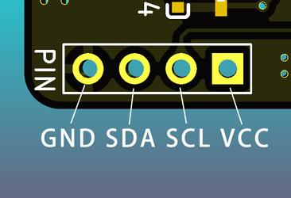

GT PAD Rev.A 标准数字小键盘
=====================

## 描述

- 4x5的数字小键盘
- 支持RGB轴灯（无灯效）
- Type-C接口
- 蓝牙主控为nRF52832（Raytac MDBT42Q-512KV2蓝牙模块）
- 采用热拔插方式（佳达隆轴座）
- 支持旋转编码器、OLED屏幕
- 轴灯兼指示灯功能
- 共引出5个针脚可自行添加外设
- 预留WS2812 RGB灯带焊接位
- PCB尺寸：76.2mm×95.2mm

## 指示灯说明

轴灯分为轴灯模式和指示灯模式，出厂默认为指示灯模式，可通过<kbd>Lshift</kbd>+<kbd>Rshift</kbd>+<kbd>L</kbd> 在指示灯模式和轴灯模式之间切换。

轴灯在指示灯模式时，通过不同的颜色指示状态：

- 蓝色-蓝牙连接成功、蓝牙输出
- 绿色-USB输出
- 粉色-蓝牙通道1️⃣广播中
- 黄色-蓝牙通道2️⃣广播中
- 红色-蓝牙通道3️⃣广播中
- USB连接状态下，状态灯常亮
- 蓝牙连接状态下，指示灯5秒后自动熄灭（可自定义常亮时长）
- 蓝牙广播30秒后未连接自动熄灭。

## 系统控制说明

由于PAD按键较少，没有<kbd>Shift</kbd>等按键，无法使用系统内置功能按键，

请使用配置工具自行配置 <kbd>BT 1</kbd> / <kbd>BT 2</kbd> / <kbd>BT 3</kbd> / <kbd>BT 广播</kbd> 等按键进行系统操作

## 轴灯说明

轴灯分为轴灯模式和指示灯模式，出厂默认为指示灯模式

当前轴灯版PCB采用蓝牙主控直接驱动RGB灯，所以无复杂灯效，仅有单色常亮、单色呼吸和彩虹循环，可手动调色，可视为单色轴灯的增强版本。

## 如何启用旋钮编码器

只需要将旋钮编码器焊接到ESC位置，然后接入配置工具，找到键盘设置--布局配置--编码器选项，将按键更改成编码器。

顶部出现的两颗按钮就是旋转功能，下面第一颗按键，就是旋钮按键功能。

## 如何控制蓝牙、控制轴灯

建议到手后自行设置按键：将PAD接入配置工具，找到 层级/功能--键盘功能，将蓝牙控制功能（BT字样的按键）和RGB控制功能（RGB字样的按键）设定到你指定的按键上就可以控制了。

出厂固件，默认是按下DEL键切换到第二层，如下图所示按键控制RGB与蓝牙：

采用<kbd>BT 1</kbd> / <kbd>BT 2</kbd> / <kbd>BT 3</kbd>按键切换蓝牙通道后，需要按下<kbd>BT 广播</kbd>手动开启蓝牙广播

## 如何接入OLED屏幕
购买ssd1306驱动的128*32分辨率的OLED屏幕，如下图找到PCB的位置，将屏幕对应接口焊接好既可。

## 开源下载

提供PCB制造文件、定位板制造文件、外壳3D图纸等硬件开源文件。可自行下载进行PCB制造或外壳打印、CNC。

请勿商用、请勿删除PCB上标识

<a href="https://eyun.baidu.com/s/3brmyk0n" class="button">开源文件下载</a>

## 固件下载

!!! tip  "本页面提供的蓝牙固件基于nRF SDK17.1    [怎么切换SDK版本？](../faq.md#怎样切换不同SDK版本的固件)"

[:fontawesome-solid-download:  20220128蓝牙完整固件](http://glab.online/down/Glab3.0/gt-pad-a-nrf52_all-20220128-1151e4a4.hex){ .md-button}

[:fontawesome-solid-tools:  获取更多下载](../down/download.md){ .md-button}
