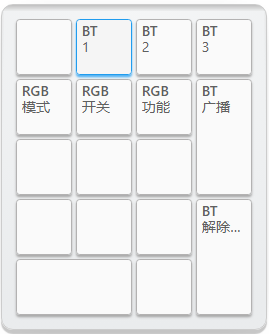

GT PAD Rev.B 标准数字小键盘
=====================

## 描述

- 4x5的数字小键盘
- 支持RGB轴灯（QMK灯效）
- Type-C接口,引出外接USB接口
- 蓝牙主控为nRF52832（芯片+陶瓷天线）
- 采用热拔插方式（佳达隆轴座）
- 支持旋转编码器、OLED屏幕
- 共引出6个针脚可自行添加外设
- PCB尺寸：76.2mm×95.2mm

## 系统控制说明

由于PAD按键较少，没有<kbd>Shift</kbd>等按键，无法使用系统内置功能按键，

请使用配置工具自行配置 <kbd>BT 1</kbd> / <kbd>BT 2</kbd> / <kbd>BT 3</kbd> / <kbd>BT 广播</kbd> 等按键进行系统操作

## RGB轴灯说明

此版轴灯采用WS2812 RGB灯，支持各种灯效（QMK灯效），暂时不支持指示灯功能。

## 如何启用旋钮编码器

只需要将旋钮编码器焊接到ESC位置，然后接入配置工具，找到键盘设置--布局配置--编码器选项，将按键更改成编码器。

顶部出现的两颗按钮就是旋转功能，下面第一颗按键，就是旋钮按键功能。

## 如何控制蓝牙、控制RGB

建议到手后自行设置按键：将PAD接入配置工具，找到 层级/功能--键盘功能，将蓝牙控制功能（BT字样的按键）设定到你指定的按键上就可以控制蓝牙。找到  灯光 功能，将RGB阵列相关按键设定到你指定的按键上既可以控制RGB灯光。

出厂固件，默认是按下DEL键切换到第二层，如下图所示按键控制RGB与蓝牙：

采用<kbd>BT 1</kbd> / <kbd>BT 2</kbd> / <kbd>BT 3</kbd>按键切换蓝牙通道后，需要按下<kbd>BT 广播</kbd>手动开启蓝牙广播

