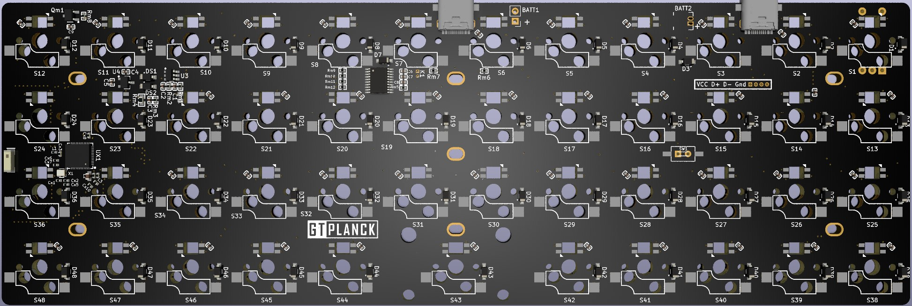
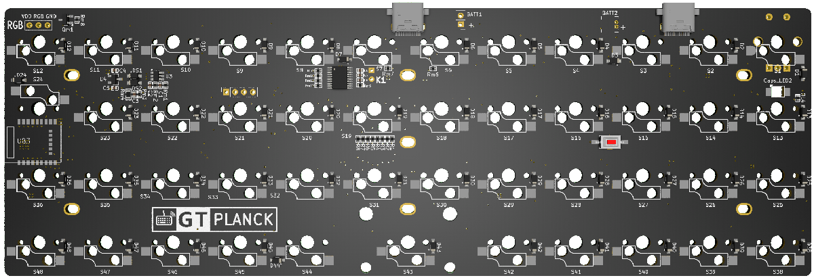
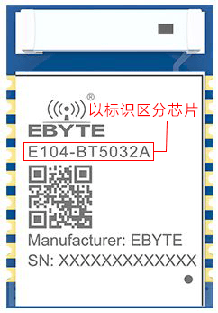

GT Planck 直列40%的键盘
=====================

GT Planck rev.B
---------------

#### 描述

- 4x12的47键键盘
- 支持RGB轴灯（同QMK灯效）
- Type-C接口,引出外接USB接口
- 键盘主控为nRF52810（芯片+贴片天线）
- 采用热拔插方式（佳达隆轴座）
- 支持旋转编码器
- RGB轴灯兼容指示灯
- PCB尺寸：228.5mm×76.2mm

相比A版本，支持任意键唤醒，加入了RGB轴灯

#### RGB轴灯说明

此版轴灯采用WS2812 RGB灯，支持各种丰富绚丽的灯效（同QMK灯效），支持Caps指示灯、USB与蓝牙状态指示灯。

可采用<kbd>Lshift</kbd>+<kbd>Rshift</kbd>+<kbd>Z</kbd> <kbd>X</kbd> <kbd>C</kbd> <kbd>V</kbd>等RGB控制功能调整RGB轴灯。

或 接入配置工具，找到 灯光 功能，将RGB阵列相关按键设定到你指定的按键上控制RGB灯光。

由于WS2812的静态耗电非常大，哪怕是Keypress类灯效（只有按键后才会亮灯），耗电也很大。所以在使用电池供电时，请尽量关闭RGB以便节电。需要使用灯效的情况，建议采用USB供电。

#### 指示灯说明

由第二排左起第一颗灯指示Capslock状态；由第一排左起第二颗灯指示键盘输出状态；

- 绿色-USB输出
- 蓝色-蓝牙通道1️⃣输出
- 红色-蓝牙通道2️⃣输出
- 橙色-蓝牙通道3️⃣输出
- 青色-2.4G无线接收器1️⃣
- 紫色-2.4G无线接收器2️⃣
- 粉色-2.4G无线接收器3️⃣

指示灯可通过<kbd>Lshift</kbd>+<kbd>Rshift</kbd>+<kbd>L</kbd> 或 通过配置工具设置一颗<kbd>状态灯开关</kbd>按键 开关

指示灯支持独立运行，建议在使用电池时，关闭RGB轴灯，开启指示灯，指示灯将可自动关闭节能

#### 如何启用旋钮编码器

只需要将旋钮编码器焊接到ESC位置，然后接入配置工具，找到键盘设置--布局配置--编码器选项，将按键更改成编码器。

顶部出现的两颗按钮就是旋转功能，下面第一颗按键，就是旋钮按键功能。

GT Planck rev.A
---------------

#### 描述

- 4×12的47键键盘（实际阵列为8x7）
- Type-C接口（支持左侧与中间两个位置）
- 键盘主控为nRF52832或nRF52811
- 采用热拔插方式（佳达隆轴座）
- 支持旋转编码器
- 仅Caps指示灯（兼带蓝牙指示）
- 预留WS2812 RGB灯带焊接位
- PCB尺寸：7.62mm×22.86mm

采用了LESS IO 方式实现键盘矩阵，所以矩阵实际使用IO口为8个，最多可支持56键

#### 指示灯说明

Planck仅有一颗Caps指示灯，在关机和开机时会闪烁一次。

蓝牙广播状态，Caps指示灯会闪烁，蓝牙连接成功后，Caps灯会恢复Caps指示（Caps原本状态）

#### 关于休眠及唤醒

由于Planck采用了LESS IO方式实现键盘矩阵，所以无法实现任意键唤醒。

键盘休眠后，只能使用第一颗按键、PCB背部按钮、插入USB线三种方式唤醒键盘。

如开启了`启动按键`功能，手动休眠后需要同时按<kbd>SPACE</kbd>+<kbd>U</kbd>+第一颗按键唤醒

#### 键盘主控的区别

Planck使用nRF52832或nRF52811芯片，请注意区分：

-  如果键盘主控模块钢壳上标识为E104-BT5032A，采用的nRF52832蓝牙芯片
-  如果键盘主控模块钢壳上标识为E104-BT5011A，采用的nRF52811蓝牙芯片

两者的主要区别：

-  基本功能上没有区别。
-  nRF52832支持DFU升级，nRF52811不支持DFU升级
-  nRF52832拥有更高的性能，资源更丰富，有更好的后续扩展性
-  nRF52811芯片发布时间晚一点，支持更多蓝牙5.2特性

下载及说明
---------------
[:fontawesome-solid-download:  下载固件](https://down.glab.online:5550/Glab3.1/){ .md-button}

[:fontawesome-solid-screwdriver-wrench:  获取更多下载](../down/download.md){ .md-button}

访问 [使用说明](../../manual) / [常见问答](../../faq) / [故障排除](../../trouble)