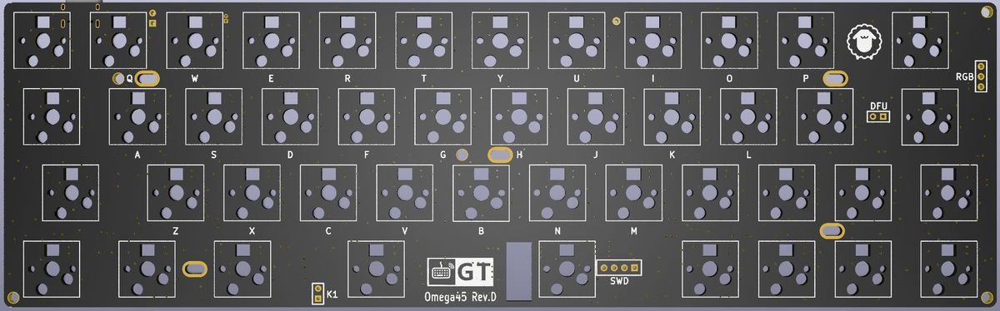

Omega45 45%小型键盘
=====================

Omega45 Rev.F
-----------------

#### 描述

- 4x12阵列的45%键盘，共45键
- 支持RGB轴灯（同QMK灯效）
- Type-C接口,引出外接USB接口
- 键盘主控为nRF52832 或nRF52810（芯片+贴片天线）
- 采用热拔插方式（佳达隆轴座）
- 支持旋转编码器
- 共引出5个针脚可自行添加外设
- RGB轴灯兼容指示灯
- PCB尺寸：247.7mm×76.2mm

相比rev.E版本：不再采用模块，而是芯片+贴片天线，实测信号与E版本信号持平甚至略有超过；支持DCDC模式，更省电。

#### RGB轴灯说明

此版轴灯采用WS2812 RGB灯，支持各种丰富绚丽的灯效（同QMK灯效），支持Caps指示灯、USB与蓝牙状态指示灯。

可采用<kbd>Lshift</kbd>+<kbd>Rshift</kbd>+<kbd>Z</kbd> <kbd>X</kbd> <kbd>C</kbd> <kbd>V</kbd>等RGB控制功能调整RGB轴灯。

或 接入配置工具，找到 灯光 功能，将RGB阵列相关按键设定到你指定的按键上控制RGB灯光。

由于WS2812的静态耗电非常大，哪怕是Keypress类灯效（只有按键后才会亮灯），耗电也很大。所以在使用电池供电时，请尽量关闭RGB以便节电。需要使用灯效的情况，建议采用USB供电。

#### 指示灯说明

由第二排左起第一颗灯指示Capslock状态；由第一排左起第二颗灯指示键盘输出状态；

- 绿色-USB输出
- 蓝色-蓝牙通道1️⃣输出
- 红色-蓝牙通道2️⃣输出
- 橙色-蓝牙通道3️⃣输出
- 青色-2.4G无线接收器1️⃣
- 紫色-2.4G无线接收器2️⃣
- 粉色-2.4G无线接收器3️⃣

指示灯可通过<kbd>Lshift</kbd>+<kbd>Rshift</kbd>+<kbd>L</kbd> 或 通过配置工具设置一颗<kbd>状态灯开关</kbd>按键 开关

指示灯支持独立运行，建议在使用电池时，关闭RGB轴灯，开启指示灯，指示灯将可自动关闭节能

#### 如何启用旋钮编码器

只需要将旋钮编码器焊接到ESC位置，然后接入配置工具，找到键盘设置--布局配置--编码器选项，将按键更改成编码器。

顶部出现的两颗按钮就是旋转功能，下面第一颗按键，就是旋钮按键功能。

Omega45 Rev.E
-----------------

#### 描述

- 4x12阵列的45%键盘，共45键
- 支持RGB轴灯（无灯效）
- Type-C接口
- 键盘主控为nRF52832（Raytac MDBT42Q-512KV2蓝牙模块）
- 采用热拔插方式（佳达隆轴座）
- 支持旋转编码器
- 轴灯兼指示灯功能
- 共引出4个针脚可自行定义
- 预留WS2812 RGB灯带焊接位
- 暂无Caps Lock、Num Lock、Screen Lock指示功能
- PCB尺寸：247.7mm×76.2mm

相比rev.D版本：采用高品质的主控模块，贴片天线信号更稳定可靠；引出4个针脚可自行定义；支持PCB卫星轴。

#### 指示灯说明

轴灯在指示灯模式时，通过不同的颜色指示状态：

- 蓝色-蓝牙连接成功、蓝牙输出
- 绿色-USB输出
- 粉色-蓝牙通道1️⃣广播中
- 黄色-蓝牙通道2️⃣广播中
- 红色-蓝牙通道3️⃣广播中
- USB连接状态下，状态灯常亮
- 蓝牙连接状态下，指示灯5秒后自动熄灭（可自定义常亮时长）
- 蓝牙广播30秒后未连接自动熄灭。

#### 轴灯说明

轴灯分为轴灯模式和指示灯模式，出厂默认为指示灯模式，可通过<kbd>Lshift</kbd>+<kbd>Rshift</kbd>+<kbd>L</kbd> 或 通过配置工具设置一颗<kbd>状态灯开关</kbd>按键  在指示灯模式和轴灯模式之间切换。

当前轴灯版PCB采用键盘主控直接驱动RGB灯，所以无复杂灯效，仅有单色常亮、单色呼吸和彩虹循环，可手动调色，可视为单色轴灯的增强版本。

轴灯模式时，采用<kbd>Lshift</kbd>+<kbd>Rshift</kbd>+<kbd>Z</kbd> <kbd>X</kbd> <kbd>C</kbd> <kbd>V</kbd>等RGB控制功能调整轴灯。

#### 如何启用旋钮编码器

只需要将旋钮编码器焊接到ESC位置，然后接入配置工具，找到键盘设置--布局配置--编码器选项，将按键更改成编码器。

顶部出现的两颗按钮就是旋转功能，下面第一颗按键，就是旋钮按键功能。

Omega45 Rev.D
------------

#### 描述

- 4x12阵列的45%键盘，共45键
- 支持RGB轴灯（无灯效）
- Type-C接口
- 键盘主控为nRF52832（信驰达RF-BM-ND04蓝牙模块）
- 采用热拔插方式（佳达隆轴座）
- 轴灯兼指示灯功能
- 预留3个指示灯焊接位
- 预留WS2812 RGB灯带焊接位
- 暂无Caps Lock、Num Lock、Screen Lock指示功能
- PCB尺寸：247.7mm×76.2mm

#### 指示灯说明

轴灯在指示灯模式时，通过不同的颜色指示状态：

- 蓝色-蓝牙连接成功、蓝牙输出
- 绿色-USB输出
- 粉色-蓝牙通道1️⃣广播中
- 黄色-蓝牙通道2️⃣广播中
- 红色-蓝牙通道3️⃣广播中
- USB连接状态下，状态灯常亮
- 蓝牙连接状态下，指示灯5秒后自动熄灭（可自定义常亮时长）
- 蓝牙广播30秒后未连接自动熄灭。

#### RGB轴灯说明

轴灯分为轴灯模式和指示灯模式，出厂默认为指示灯模式，可通过<kbd>Lshift</kbd>+<kbd>Rshift</kbd>+<kbd>L</kbd> 或 通过配置工具设置一颗<kbd>状态灯开关</kbd>按键  在指示灯模式和轴灯模式之间切换。

当前轴灯版PCB采用键盘主控直接驱动RGB灯，所以无复杂灯效，仅有单色常亮、单色呼吸和彩虹循环，可手动调色，可视为单色轴灯的增强版本。

轴灯模式时，采用<kbd>Lshift</kbd>+<kbd>Rshift</kbd>+<kbd>Z</kbd> <kbd>X</kbd> <kbd>C</kbd> <kbd>V</kbd>等RGB控制功能调整轴灯。

Omega45 Rev.C 
---------

部分老旧PCB上没有版本标识或标识版本低于C版本，属于Rev.C 版本

- 4x12阵列的45%键盘，共45键
- 一个Caps灯和三个单色状态指示灯,无轴灯
- Type-C接口
- 键盘主控为nRF52832（信驰达RF-BM-ND04蓝牙模块）
- 采用热拔插方式（佳达隆轴座）
- 预留WS2812 RGB灯带焊接位
- PCB尺寸：247.7mm×76.2mm

#### 下载

[:fontawesome-solid-download:  下载固件](https://down.glab.online:5550/Glab3.1/){ .md-button}

[:fontawesome-solid-screwdriver-wrench:  获取更多下载](../down/download.md){ .md-button}

#### 更多使用说明

访问 [使用说明](../../manual) / [常见问答](../../faq) / [故障排除](../../trouble)