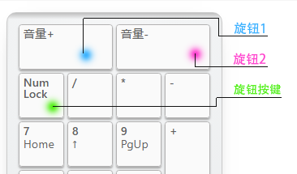

Omega45 Rev.F 介绍
=====================
本页面仅描述rev.F版本（RGB轴灯版）相关信息

描述
---------

- 4x12阵列的45%键盘，共45键
- 支持RGB轴灯（同QMK灯效）
- Type-C接口,引出外接USB接口
- 蓝牙主控为nRF52832（芯片+陶瓷天线）
- 采用热拔插方式（佳达隆轴座）
- 支持旋转编码器
- 共引出5个针脚可自行添加外设
- 暂无Caps Lock、Num Lock、Screen Lock指示功能
- PCB尺寸：247.7mm×76.2mm

相比rev.E版本：不再采用模块，而是芯片+陶瓷天线，实测信号与E版本信号持平甚至略有超过；支持DCDC模式，更省电。

## RGB轴灯说明

此版轴灯采用WS2812 RGB灯，支持各种丰富绚丽的灯效（同QMK灯效），暂时不支持指示灯功能。

可采用<kbd>Lshift</kbd>+<kbd>Rshift</kbd>+<kbd>Z</kbd> <kbd>X</kbd> <kbd>C</kbd> <kbd>V</kbd>等RGB控制功能调整RGB轴灯。

或 接入配置工具，找到 灯光 功能，将RGB阵列相关按键设定到你指定的按键上控制RGB灯光。

由于WS2812的静态耗电非常大，哪怕是Keypress类灯效（只有按键后才会亮灯），耗电也很大。所以在使用电池供电时，请尽量关闭RGB以便节电。需要使用灯效的情况，建议采用USB供电。

## 如何启用旋钮编码器

只需要将旋钮编码器焊接到ESC位置，然后接入配置工具，找到键盘设置--布局配置--编码器选项，将按键更改成编码器。

顶部出现的两颗按钮就是旋转功能，下面第一颗按键，就是旋钮按键功能。

