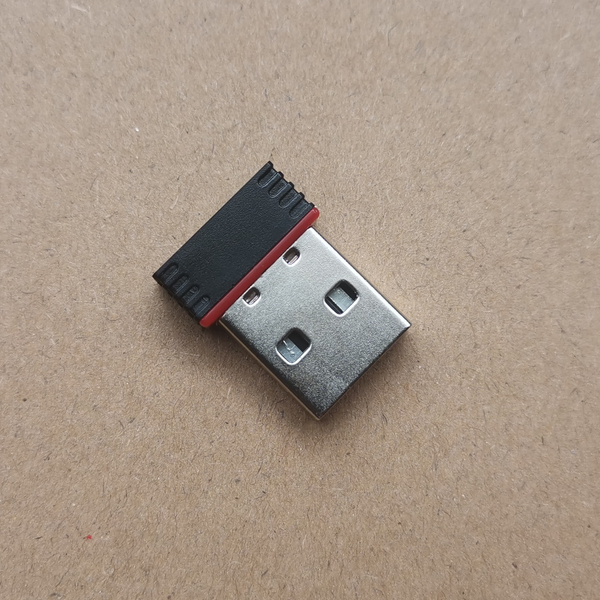

2.4G无线接收器
=====================

{ align=right width="420"}

## 2.4G接收器描述

- 硬件采用 ch554e + nRF52810的组合
- 贴片天线
- 黑红相间的外壳
- 尺寸：19mm×14.6mm×6.3mm

## 2.4G的一些特性

1. 一个接收器支持配对7个设备，支持最高7个设备同时在线
2. 一个键盘仅支持配对一个接收器 （暂时）
3. 接收器配对采用开放模式，不需要特别设定，不需要程序干预
4. 与蓝牙、USB可以实现无缝切换

## 2.4G接收器配对

1. 将接收器插入电脑USB口通电
2. 键盘切换到2.4G无线模式
3. 键盘未配对：按下<kbd>Lshift</kbd>+<kbd>Rshift</kbd>+<kbd>R</kbd>启动配对通讯，即可配对完成
4. 键盘已配对：按下<kbd>Lshift</kbd>+<kbd>Rshift</kbd>+<kbd>O</kbd>删除配对信息，按下<kbd>Lshift</kbd>+<kbd>Rshift</kbd>+<kbd>R</kbd>启动绑定通讯，即可配对到新的接收器
5. 如PAD等小键盘，无<kbd>Lshift</kbd>、<kbd>Rshift</kbd>，可通过配置工具配置<kbd>无线 广播配对</kbd>/<kbd>无线 解除配对</kbd>，启动配对通讯、删除配对信息

## 键盘如何支持2.4G功能

1. 所有Glab键盘[^1]升级20220624版及以后固件都可支持2.4G功能。已经刷入2.4G测试固件的需要升级新的正式固件
2. 你需要到[淘宝店铺](https://glab.taobao.com)购买一个2.4G无线接收器
3. 将键盘刷写支持2.4G无线功能的固件，从双模固件升级的，刷写时注意勾选"擦除蓝牙芯片"，刷写键盘主控完整固件
4. 刷完固件用<kbd>Lshift</kbd>+<kbd>Rshift</kbd>+<kbd>U</kbd> （或者通过配置工具配置一个无线模式切换按键）切换无线模式
5. 完成2.4G接收器配对即可正常使用2.4G无线功能

## 接收器配对满载后如何配对设备

当7个设备位置绑定完成后，接收器将不再接收配对新设备，如需配对新的设备，需要先重置接收器。

重置接收器，配对新设备方法：

1. 将接收器插入电脑USB口，并使用浏览器[^2]访问[接收器控制面板](https://wiki.glab.online/2.4G/index.html)
2. 首次使用需授权：点击 <kbd>授权设备</kbd> 按钮，弹出授权面板，选择设备，点击<kbd>连接</kbd>授权连接接收器
3. 授权成功后，每次插入接收器，访问[接收器控制面板](https://wiki.glab.online/2.4G/index.html)会自动连接接收器
4. 点击 <kbd>重置接收器</kbd> 可重置键盘配对索引，重置后建议重新拔插接收器，即可接受新的键盘绑定。
5. 重置后，已经配对的键盘依然可以正常访问，接收器会根据键盘连接情况，重新建立索引。
6. 为避免冲突，重置接收器前，不再配对到接收器的键盘请提前按下双shift+O删除绑定信息，空出索引位置。
7. 配对的键盘重新访问接收器完成配对，或重新配对到接收器。

## 接收器如何更新固件

接收器长期插在电脑USB口上，为避免为键盘刷机时误刷入接收器，接收器默认是不能刷写USB固件和主控固件的。

在刷写固件之前，需要先通过[接收器控制面板](https://wiki.glab.online/2.4G/index.html) 启用刷写功能

1. 将接收器插入电脑USB口，并使用浏览器[^2]访问[接收器控制面板](https://wiki.glab.online/2.4G/index.html)
2. 首次使用需授权：点击 <kbd>授权设备</kbd> 按钮，弹出授权面板，选择设备，点击<kbd>连接</kbd>授权连接接收器
3. 授权成功后，每次插入接收器，访问[接收器控制面板](https://wiki.glab.online/2.4G/index.html)会自动连接接收器
4. 需要刷写USB固件的话，点击<kbd>进入 USB ISP模式</kbd> 按钮，启用USB ISP模式，随后按照键盘刷写USB固件的方法刷写USB固件
5. 需要刷写主控固件的话，点击<kbd>启用CMSIS-DAP</kbd> 按钮，启用CMSIS-DAP刷写功能，随后按照键盘刷写键盘主控固件的方法刷写主控固件
6. 刷写固件后，请重新拔插接收器，以便恢复默认禁止刷写状态

[^1]: 过于老旧的PCB不支持线刷固件，无法升级到最新固件版，需要自行使用Jlink等烧录器通过PCB上SWD接口烧录升级固件
[^2]: 当前支持的浏览器包括chrome 89+ / EDGE 89+ / Opera 75+