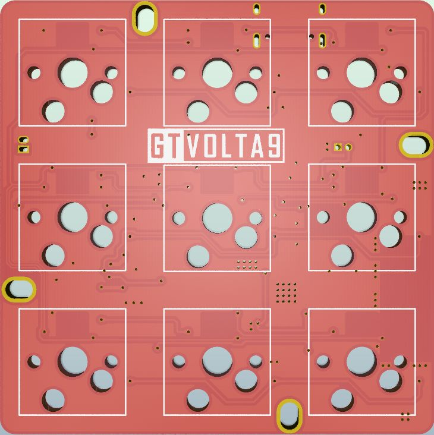

Volta 9 Rev.A 九键小键盘
=====================

## 描述

- 3x3的9键小键盘
- 支持RGB轴灯（同QMK灯效）
- Type-C接口
- 蓝牙主控为nRF52810（芯片+贴片天线）
- 采用热拔插方式（佳达隆轴座）
- RGB轴灯兼容指示灯
- PCB尺寸：57.2mm×57.2mm

## 系统控制说明

由于按键较少，没有<kbd>Shift</kbd>等按键，无法使用系统内置功能按键，

请使用配置工具自行配置 <kbd>BT 1</kbd> / <kbd>BT 2</kbd> / <kbd>BT 3</kbd> / <kbd>BT 广播</kbd> 等按键进行系统操作

## RGB轴灯说明

此版轴灯采用WS2812 RGB灯，支持各种丰富绚丽的灯效（同QMK灯效），支持Numlock指示灯、USB与蓝牙状态指示灯。

由于WS2812的静态耗电非常大，哪怕是Keypress类灯效（只有按键后才会亮灯），耗电也很大。所以在使用电池供电时，请尽量关闭RGB以便节电。需要使用灯效的情况，建议采用USB供电。

## 指示灯说明

由第一排左起第一颗灯指示Numlock状态；由第一排左起第二颗灯指示键盘输出状态；

- 绿色-USB输出
- 青色-2.4G无线输出
- 蓝色-蓝牙通道1️⃣输出
- 红色-蓝牙通道2️⃣输出
- 橙色-蓝牙通道3️⃣输出

指示灯可通过配置工具设置一颗`状态灯开关`按键进行开关

指示灯支持独立运行，建议在使用电池时，关闭RGB轴灯，开启指示灯，指示灯将可自动关闭节能

## 如何控制蓝牙、控制RGB轴灯

建议到手后自行设置按键：将键盘接入配置工具，找到 层级/功能--键盘功能，将蓝牙控制功能（BT字样的按键）设定到你指定的按键上就可以控制蓝牙。找到 灯光 功能，将RGB阵列相关按键设定到你指定的按键上既可以控制RGB灯光。

## 固件下载

[:fontawesome-solid-download:  20220303蓝牙完整固件](http://glab.online/down/Glab3.0/volta9-a-nrf52810_all-20220303-11e13034.hex){ .md-button}

[:fontawesome-solid-screwdriver-wrench:  获取更多下载](../down/download.md){ .md-button}

## 开源下载

提供定位板制造文件、外壳3D图纸等硬件开源文件。可自行下载生产玻纤定位板或外壳打印、CNC。

请勿商用、请勿删除标识

<a href="https://eyun.baidu.com/s/3bqA4ywZ" class="button">开源文件下载</a>

## 更多使用说明

访问 [使用说明](../../manual) / [常见问答](../../faq) / [故障排除](../../trouble)