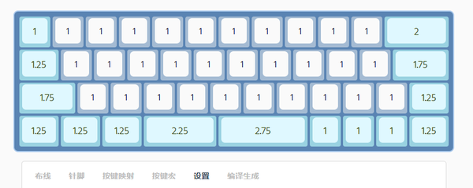

常见问答
=====================

-----------

我们需要分清烧录工具、配置工具、DFU升级这几个概念：

1. [配置工具](down/download.md#配置工具)，可用于修改键盘的设置和配列
    - 老硬件和新硬件都可使用配置工具，但需要先更新固件到新版
    - 配置工具可以直接读取键盘数据，可以直接写入配列而不用升级固件，可以存储您的配置

2. [烧录工具](down/download.md#烧录工具)，可通过USB线连接键盘，刷入`USB固件`和`蓝牙固件`。
    - 烧录工具可以更新`USB固件`和`蓝牙固件`，但老版本硬件并不支持通过烧录工具更新`蓝牙固件`

3. [DFU升级](upgrade2.md#使用_DFU_模式更新蓝牙固件) 是使用手机APP，通过蓝牙连接更新`蓝牙DFU升级包`。
    - 如果您是老版PCB，是不支持烧录工具进行烧录的，只能采用DFU升级
    - DFU升级 实际只升级了蓝牙核心固件，不会更新Bootloader与蓝牙通讯协议栈，也不会删除存储的数据

如何进入DFU模式
-----

要想进行固件DFU升级，必须正确的进入DFU升级模式，下面讲述3种进入方法：

1. 键盘系统按键进入：开机状态，按下<kbd>Lshift</kbd>+<kbd>Rshift</kbd>+<kbd>B</kbd>可进入DFU模式。如果因为自己的配列没有设定shift按键导致无法以键盘按键进入，可使用后面的方法。
2. 长按背部多功能按钮进入：开机状态，长按PCB背面的背部多功能按钮4秒以上后松手，可以进入DFU模式。
3. 断电强行进入：如果因为键盘系统崩溃了，上述两种方法都不可行,可以采用断电强行进入方式。
    - 老版本PCB，将键盘电池及USB线去掉，按住 PCB背部多功能按钮 的同时，按住第一排按键的第一个或者最后一个按键（如：BLE60、Omega64是第一个，Omega45、Omega50和Farad69是最后一个），然后插入USB线或者插入电池通电，即可强行进入DFU模式。
    - 轴灯版PCB，将键盘电池及USB线去掉，按住 PCB背部多功能按钮 的同时，插入USB线或者插入电池通电，通电4秒后松开 PCB背部多功能按钮 即可强行进入DFU模式。

注: 正确进入DFU模式后，三颗指示灯会常亮（仅新版Bootloader）。

如何退出 DFU 模式
--------------------
在 DFU 模式下无操作 1 分半钟后即可自动退出 DFU 模式。

如何进入USB刷写模式
---------------------
将键盘与电脑连接的 USB 线断开（不要接入USB，不需要取下电池）。
找到PCB上 标识为K1的两个通孔焊盘，然后用镊子之类的金属物体短接这两个焊盘。
保持短接K1位置的通孔焊盘的同时，插入USB，插入USB后可放开K1的短接。
此时USB芯片应当已经进入USB ISP刷写模式。

注: 用烧录工具烧录USB固件时，烧录工具会自动跳转USB刷写模式，无需手动短接K1。

如何外接灯带
-----

购买什么灯带：淘宝搜索ws2812灯带购买，建议购买1米30灯的规格，1米60灯的话灯带太亮灯珠太密集。

灯带怎么接：WS2812灯带DI 接 电路板上RGB； 灯带GND 接 电路板GND ； 灯带5V 接 电路板VCC。

如果键盘本身已经焊接了底灯，需要将第一颗WS2812底灯拆除，灯带才能正常工作。

如何选购电池
------
普通的3.7v的锂电池就行；

容量建议1000mah即可，不开灯情况下约可续3个月，不建议容量太大的电池；

电池的体积大小就要根据你的壳子的内部空间自己确定了；

现在店铺PCB均采用ZH1.5接口，电池请购买ZH1.5正向插。

如何改善蓝牙连接稳定性
-------------------------

蓝牙的信号可能受到多方面因素的影响，如蓝牙接收器的兼容性、如其他2.4G的通讯干扰。
在无线干扰很强的地方，会严重影响您在蓝牙模式使用键盘的体验。这并不是GT系列产品的问题，而是所有蓝牙键鼠产品都需要面临的问题。

如蓝牙信号受干扰，出现断链，输出延迟等问题。

您可以尝试以下方法来改善蓝牙信号：

1. 使用非金属外壳、非金属定位板与非金属桌面
2. 确保键盘和蓝牙接收器之间无遮挡
    -  如将蓝牙接收器从桌面下移动到桌面上
3. 将键盘和蓝牙接收器尽可能的靠近
4. USB的蓝牙接收器插入USB2.0而不是USB3.0接口，如果插入USB HUB，请选购质量较好的HUB
5. 更换蓝牙接收器,解决蓝牙兼容性问题
    -  已知部分采用国产芯片，Intel芯片的蓝牙适配器，兼容性较差
    -  选购蓝牙接收器，推荐CSR、博通等大厂芯片
    -  兼容性问题会导致信号较强时，键盘也会频繁断开连上
6. 和无线路由器保持一定距离，改善信号干扰
7. 降低2.4GHZ的WiFi的发射功率或者使用5GHZ的WiFi
8. 减少空间内其他WiFi和蓝牙设备的存在
9. 不要触摸蓝牙模块的天线位置

我们不建议采用金属外壳，虽然我们也提供了铝合金外壳，而且从实测来看，信号良好的情况下，基本都能正常使用，但信号或多或少都受影响。

如何检测键盘
----------------------------------
键盘PCB购买后，请及时按照下列步骤完成检测：

1. 下载运行 [按键检测软件](http://glab.online/down/keyboardtestutility.exe)  或 访问[按键检测网站](https://glab.online/keytest/) 。

2. 将键盘PCB用USB线连接到电脑 或 通电状态通过蓝牙连接到设备

2. 使用镊子或短导线短接键盘PCB背面热拔插轴座的两个金属脚。

3. 查看每一个脚是否都能正确的触发按键（检测网站或软件是否有按键变色）。

4. 如果都能触发，并且没有串键，证明键盘PCB完好。

注: 不是每一个按键都能被检测，如FN按键是无法被检测到的，必须和其他按键配合完成检测。
    所以检测的时候有某一个按键无法检测，也许它是一颗FN按键，请查阅默认按键进行确认。
    

如何重置键盘
------------------------

1. 或 长按PCB背面按钮10秒以上后松手。（此方式清空后，蓝牙绑定信息也会一并清空）。

2. 或 通过配置工具连接后，选择`重置键盘`进行重置。

如何查看键盘默认按键
----------------------

访问 [配置工具](http://keyboard.lotlab.org) 查看

如何查看键盘所需键帽长度
------------------
访问：[在线编译](http://rom.glab.online:666/) 。选择对应的键盘进入在线编辑。

在`设置`界面可以看到每个按键的大小，如下图：

如何确认PCB支持线刷
------------------
所谓`线刷`，即通过板载调试器进行蓝牙固件的刷写。

1. 从购买时间上判断，2020年4月之前购买的PCB都不支持，2020年6月后购买大部分支持

2. 从PCB颜色判断，PCB为黑色或白色的均支持，而绿色PCB只有极少数支持

3. 直接实验：通过CMSIS刷机工具或Lotkb固件烧录工具直接刷写固件，能正常刷入就支持
