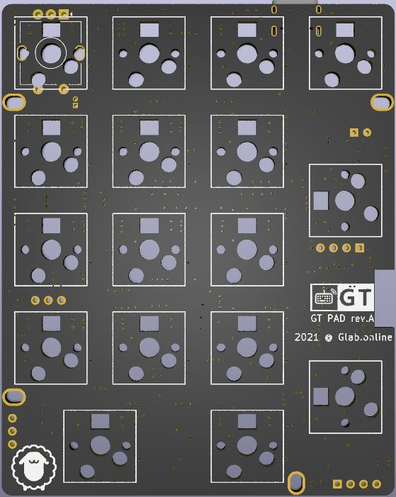
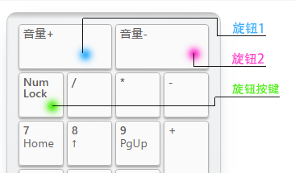
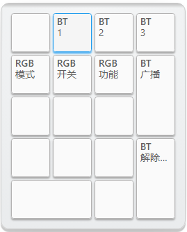

GT PAD 标准数字小键盘
=====================

## 描述

- 4x5的数字小键盘
- 支持RGB轴灯
- Type-C接口
- 蓝牙主控为nRF52832
- 采用热拔插方式（佳达隆轴座）
- 支持旋转编码器、OLED屏幕
- 轴灯兼指示灯功能
- 共引出5个针脚可自行添加外设
- 预留WS2812 RGB灯带焊接位
- PCB尺寸：76.2mm×95.2mm

## 指示灯说明

轴灯版无独立的指示灯，默认采用轴灯作为指示，可通过 <kbd>RGB功能</kbd> 在指示灯模式和轴灯模式之间切换。

- 蓝色-蓝牙连接成功、蓝牙输出
- 绿色-USB输出
- 粉色-蓝牙通道1️⃣广播中
- 黄色-蓝牙通道2️⃣广播中
- 红色-蓝牙通道3️⃣广播中
- USB连接状态下，状态灯常亮
- 蓝牙连接状态下，指示灯5秒后自动熄灭（可自定义常亮时长）
- 蓝牙广播30秒后未连接自动熄灭。

### RGB轴灯说明

RGB轴灯默认作为指示灯，可通过 <kbd>RGB功能</kbd> 在指示灯模式和轴灯模式之间切换。

当前轴灯版PCB采用蓝牙主控直接驱动RGB灯，所以无复杂灯效，仅有单色常亮、单色呼吸和彩虹循环，可手动调色，可视为单色轴灯的增强版本。

轴灯模式时，采用 <kbd>RGB模式</kbd> <kbd>RGB开关</kbd> 等RGB控制功能调整轴灯。

## 如何启用旋钮编码器

只需要将旋钮编码器焊接到ESC位置，然后接入配置工具，找到键盘设置--布局配置--编码器选项，将按键更改成编码器。

顶部出现的两颗按钮就是旋转功能，下面第一颗按键，就是旋钮按键功能。

## 如何控制蓝牙、控制RGB
建议到手后自行设置按键：将PAD接入配置工具，找到 层级/功能--键盘功能，将蓝牙控制功能（BT字样的按键）和RGB控制功能（RGB字样的按键）设定到你指定的按键上就可以控制了。

出厂固件，默认是按下DEL键切换到第二层，第二层的7/8/9控制RGB，/ * - +  enter控制蓝牙，如下图：

## 开源下载

提供PCB制造文件、定位板制造文件、外壳3D图纸等硬件开源文件。可自行下载进行PCB制造或外壳打印、CNC。

请勿商用、请勿删除PCB上标识

<a href="https://eyun.baidu.com/s/3brmyk0n" class="button">开源文件下载</a>

## 更多下载

<a href="../down/download.md" class="button2">固件及工具等下载</a>