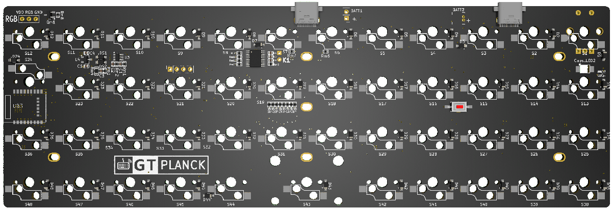

GT Planck 40%的键盘
=====================

## 描述

- 4×12的47键键盘（实际阵列为8x7）
- Type-C接口
- 蓝牙主控为nRF52832
- 采用热拔插方式（佳达隆轴座）
- 支持旋转编码器
- 仅Caps指示灯
- 预留WS2812 RGB灯带焊接位
- PCB尺寸：7.62mm×22.86mm

采用了LESS IO 方式实现键盘矩阵，所以矩阵实际使用IO口为8个，最多可支持56键

## 指示灯说明

Planck仅有一颗Caps指示灯，在关机和开机时会闪烁一次。

蓝牙广播状态，Caps指示灯会闪烁，蓝牙连接成功后，Caps灯会恢复Caps指示（Caps原本状态）

## 关于休眠及唤醒

由于Planck采用了LESS IO方式实现键盘矩阵，所以无法实现任意键唤醒。

键盘休眠后，只能使用第一颗按键唤醒键盘 或 插入USB线唤醒键盘。

## 更多下载

<a href="../down/download.md" class="button2">固件及工具等下载</a>