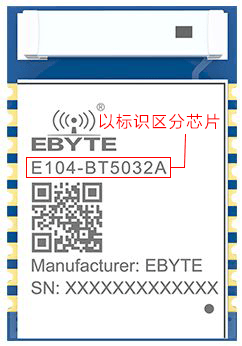

GT Planck 40%的键盘
=====================

## 描述

- 4×12的47键键盘（实际阵列为8x7）
- Type-C接口
- 蓝牙主控为nRF52832或nRF52811
- 采用热拔插方式（佳达隆轴座）
- 支持旋转编码器
- 仅Caps指示灯（兼带蓝牙指示）
- 预留WS2812 RGB灯带焊接位
- PCB尺寸：7.62mm×22.86mm

采用了LESS IO 方式实现键盘矩阵，所以矩阵实际使用IO口为8个，最多可支持56键

## 指示灯说明

Planck仅有一颗Caps指示灯，在关机和开机时会闪烁一次。

蓝牙广播状态，Caps指示灯会闪烁，蓝牙连接成功后，Caps灯会恢复Caps指示（Caps原本状态）

## 关于休眠及唤醒

由于Planck采用了LESS IO方式实现键盘矩阵，所以无法实现任意键唤醒。

键盘休眠后，只能使用第一颗按键、PCB背部按钮、插入USB线三种方式唤醒键盘。

## 蓝牙主控的区别

Planck使用nRF52832或nRF52811芯片，请注意区分：

-  如果蓝牙主控模块钢壳上标识为E104-BT5032A，采用的nRF52832蓝牙芯片
-  如果蓝牙主控模块钢壳上标识为E104-BT5011A，采用的nRF52811蓝牙芯片

两者的主要区别：

-  基本功能上没有区别。
-  nRF52832支持DFU升级，nRF52811不支持DFU升级
-  nRF52832拥有更高的性能，更好的后续扩展性
-  nRF52811芯片更新，支持更多蓝牙5.2特性

## 固件下载

注: Planck使用nRF52832或nRF52811芯片，请注意区分（查看模块标识）

<a href="http://glab.online/down/sdk17/gt_planck40a_20210710_nrf52832_all.hex" class="button">蓝牙完整固件:芯片nRF52832.20210710</a>

<a href="http://glab.online/down/sdk17/gt_planck40a_20210815_nrf52811_all.hex" class="button">蓝牙完整固件:芯片nRF52811.20210815</a>

<a href="../down/download.md" class="button2">工具等下载</a>
