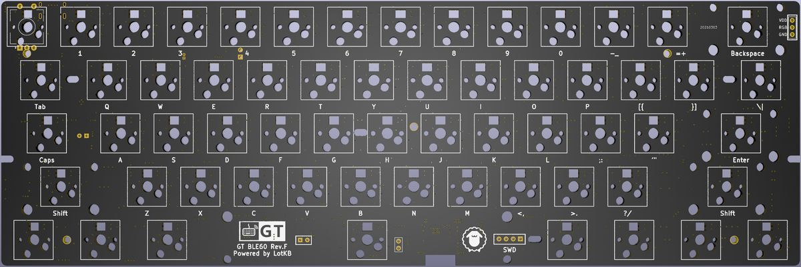

GT BLE60 rev.F 键盘
=====================
本页面仅描述rev.F版本（轴灯版）相关信息

## 描述

- 5x13的60%键盘
- 支持RGB轴灯
- Type-C接口
- 蓝牙主控为nRF52832
- 采用热拔插方式（佳达隆轴座）
- 支持旋转编码器 及 OLED屏幕
- 轴灯兼指示灯功能
- 共引出2个针脚可自行定义
- 预留WS2812 RGB灯带焊接位
- PCB尺寸：285mm×95.3mm

## 指示灯说明
- 蓝色-蓝牙连接成功、蓝牙输出
- 绿色-USB输出
- 粉色-蓝牙通道1️⃣广播中
- 黄色-蓝牙通道2️⃣广播中
- 红色-蓝牙通道3️⃣广播中
- USB连接状态下，状态灯常亮
- 蓝牙连接状态下，指示灯5秒后自动熄灭（可自定义常亮时长）
- 蓝牙广播30秒后未连接自动熄灭。

## 如何启用旋钮编码器

只需要将旋钮编码器焊接到ESC位置，然后接入配置工具，找到键盘设置--布局配置--编码器选项，将按键更改成编码器。

顶部的出线的两颗按钮就是旋转功能，下面第一颗按键，就是旋钮按键功能。

下载
---------

[相关下载](../download.md) 