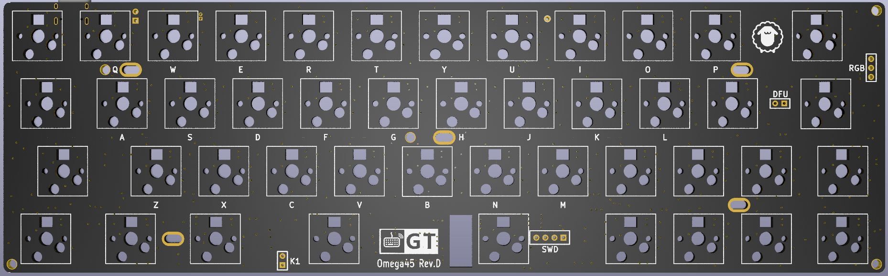

Omega45 Rev.D 介绍
=====================

描述
---------

- 4x12阵列的45%键盘，共45键
- 支持RGB轴灯（需自行焊接3528反贴RGB灯）
- Type-C接口
- 蓝牙主控为nRF52832
- 采用热拔插方式（佳达隆轴座）
- 轴灯兼指示灯功能
- 预留3个指示灯焊接位
- 预留WS2812 RGB灯带焊接位
- 暂无Caps Lock、Num Lock、Screen Lock指示功能
- PCB尺寸：247.7mm×76.2mm

指示灯说明
----------
- 蓝色-蓝牙连接成功、蓝牙输出
- 绿色-USB输出
- 粉色-蓝牙通道1️⃣广播中
- 黄色-蓝牙通道2️⃣广播中
- 红色-蓝牙通道3️⃣广播中
- USB连接状态下，状态灯常亮
- 蓝牙连接状态下，指示灯5秒后自动熄灭（可自定义常亮时长）
- 蓝牙广播30秒后未连接自动熄灭。

固件下载
---------

2021-01-02新固件

优化了指示灯功能
完善轴灯和指示灯切换
指示灯省电模式关闭PWM
修正TRICKY_L与Command L冲突的问题

<a href="http://glab.online/down/omega45/d/Omega45-d-nrf52_kbd_sign.hex" class="button">蓝牙核心固件</a>

[更多下载](../download.md) 