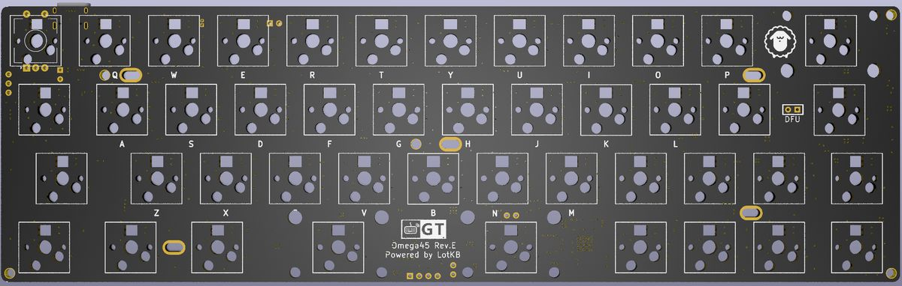

Omega45 Rev.E 介绍
=====================
本页面仅描述rev.E版本（轴灯版）相关信息

描述
---------

- 4x12阵列的45%键盘，共45键
- 支持RGB轴灯
- Type-C接口
- 蓝牙主控为nRF52832
- 采用热拔插方式（佳达隆轴座）
- 支持旋转编码器
- 轴灯兼指示灯功能
- 共引出4个针脚可自行定义
- 预留WS2812 RGB灯带焊接位
- 暂无Caps Lock、Num Lock、Screen Lock指示功能
- PCB尺寸：247.7mm×76.2mm

相比rev.D版本：采用高品质的主控模块，陶瓷天线信号更稳定可靠；引出4个针脚可自行定义；支持PCB卫星轴。

## 指示灯说明

轴灯版无独立的指示灯，默认采用轴灯作为指示，可通过<kbd>Lshift</kbd>+<kbd>Rshift</kbd>+<kbd>L</kbd> 在指示灯模式和轴灯模式之间切换。

- 蓝色-蓝牙连接成功、蓝牙输出
- 绿色-USB输出
- 粉色-蓝牙通道1️⃣广播中
- 黄色-蓝牙通道2️⃣广播中
- 红色-蓝牙通道3️⃣广播中
- USB连接状态下，状态灯常亮
- 蓝牙连接状态下，指示灯5秒后自动熄灭（可自定义常亮时长）
- 蓝牙广播30秒后未连接自动熄灭。

### RGB轴灯说明

RGB轴灯默认作为指示灯，可通过<kbd>Lshift</kbd>+<kbd>Rshift</kbd>+<kbd>L</kbd> 在指示灯模式和轴灯模式之间切换。

当前轴灯版PCB采用蓝牙主控直接驱动RGB灯，所以无复杂灯效，仅有单色常亮、单色呼吸和彩虹循环，可手动调色，可视为单色轴灯的增强版本。

轴灯模式时，采用<kbd>Lshift</kbd>+<kbd>Rshift</kbd>+<kbd>Z</kbd> <kbd>X</kbd> <kbd>C</kbd> <kbd>V</kbd>等RGB控制功能调整轴灯。

## 如何启用旋钮编码器

只需要将旋钮编码器焊接到ESC位置，然后接入配置工具，找到键盘设置--布局配置--编码器选项，将按键更改成编码器。

顶部出现的两颗按钮就是旋转功能，下面第一颗按键，就是旋钮按键功能。

## 固件下载

USB固件无需更新，不提供下载

<a href="http://glab.online/down/omega45e/omega45e_20210703_nrf52_kbd_sign.hex" class="button2">20210703蓝牙核心固件</a>

<a href="http://glab.online/down/omega45e/omega45e_20210703_nrf52_all.hex" class="button2">20210703蓝牙完整固件</a>
