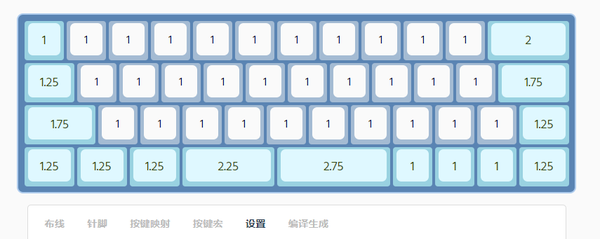

键盘使用说明
=====================

相关概念
-----

### 开机
GT系列蓝牙双模键盘PCB没有硬件电源开关，只需要接入电池或插入USB通电后，键盘就自动开机。

如果通过软关机后，可以通过插入USB线或者按击一下背部多功能按钮实现开机。

### 关机
通过按下背部多功能按钮1秒以上后松手 或 系统功能按键<kbd>Lshift</kbd>+<kbd>Rshift</kbd>+<kbd>Backspace</kbd>或<kbd>~</kbd>进入关机状态

### 自动休眠
在一定时间不敲击按键后，键盘将自动进入休眠模式以便省电。自动休眠时间可以自由设定。

自动休眠后，按任意键即可唤醒键盘重新工作。

插入 USB 后，是由 USB 供电，自动休眠功能不会启用，如处于休眠状态也将自动唤醒。

### 手动休眠
同时按下<kbd>Lshift</kbd>+<kbd>Rshift</kbd>+<kbd>P</kbd>可以手动进入休眠模式

手动休眠后，按任意键即可唤醒键盘重新工作。

如果启用了`启动按键`功能，手动休眠后唤醒时需要按<kbd>Space</kbd>+<kbd>U</kbd>才能唤醒键盘。

插入 USB 后，将直接唤醒键盘重新工作，并且无法手动休眠。

### 蓝牙连接设备
如需蓝牙键盘通过蓝牙连接设备，你需要完成[绑定设备](#绑定设备)的过程。

### USB 连接设备
直接将 USB 线缆插入到键盘的 USB 接口，键盘即自动切换至 USB 模式。这时候就可以使用 USB 模式输入了。

### USB / 蓝牙状态切换
同时按下<kbd>Lshift</kbd>+<kbd>Rshift</kbd>+<kbd>M</kbd>可以在USB / 蓝牙 状态之间切换

如未插入USB线，上述切换功能无效

### 省电模式
在没有接入 USB 电源的情况下，为提升续航，键盘处于省电模式。

在省电模式下，所有的指示灯仅在变化后亮起 5 秒，然后熄灭。键盘在无操作 15 秒后转入慢速扫描模式，无操作 600 秒后自动睡眠。（前述三个时间均支持自定义）

慢速扫描模式下，按键检测将可能略有延迟。在慢速扫描模式下按任意按键即可恢复到快速扫描模式。

自动睡眠后，按下键盘的任意按键即可再次唤醒。

### 电量显示
在新版本的 iOS、安卓和 Windows 上，应该能够正确的显示蓝牙设备的电量百分比。

由于测量方式可能有误差，电量百分比可能无法达到 100% 或者低至 0%，这是正常现象。电量百分比仅供参考。

对于安卓手机，如果没有正确的显示电量，可以尝试下载 BatON 软件来获取蓝牙设备电量。

其他无法显示电量的情况，可以通过<kbd>Lshift</kbd>+<kbd>Rshift</kbd>+<kbd>H</kbd>输出电量

### 全键无冲（NKRO）
此键盘支持 NKRO（全键无冲）模式，但默认不启用全键无冲。全键无冲仅在 USB 模式下才可使用。

### 启动按键
启用`启动按键`功能后，手动休眠后唤醒需按<kbd>Space</kbd>+<kbd>U</kbd>唤醒键盘。 自动休眠时，不需要按启动按键，可任意键唤醒。

默认不启用`启动按键`功能，可通过<kbd>Lshift</kbd>+<kbd>Rshift</kbd>+<kbd>I</kbd>启用或禁用。

### DFU模式
DFU模式为键盘内置的蓝牙刷机模式，在通过手机nRF Connect程序升级时，必须先进入DFU模式。

同时按下<kbd>Lshift</kbd>+<kbd>Rshift</kbd>+<kbd>B</kbd>可以重启到DFU刷机模式。也可长按PCB背部多功能按钮4秒以上后松手重启到DFU刷机模式。

### USB ISP 模式
USB ISP 模式为USB主控的烧录模式，在更新USB固件时需要先进入USB ISP模式。

短接PCB背部K1位置两个焊盘，并插入USB线可进入USP ISP模式; 用烧录工具烧录USB固件时，烧录工具会自动跳转USB ISP模式，无需手动短接K1。

### 轴灯版PCB
当前轴灯版PCB采用蓝牙主控直接驱动RGB灯，所以无复杂灯效，仅有单色常亮、单色呼吸和彩虹循环，可手动调色，可视为单色轴灯的增强版本。

轴灯版无独立的指示灯，默认采用轴灯作为指示，可通过<kbd>Lshift</kbd>+<kbd>Rshift</kbd>+<kbd>L</kbd> 在指示灯模式和轴灯模式之间切换。

轴灯模式时，采用<kbd>Lshift</kbd>+<kbd>Rshift</kbd>+<kbd>Z</kbd> <kbd>X</kbd> <kbd>C</kbd> <kbd>V</kbd>等RGB控制调整轴灯。

功能按键说明
-----

| 功能        | 按键          | 功能说明 |
| ------------| --            |---- |
| 休眠     | <kbd>Lshift</kbd>+<kbd>Rshift</kbd>+<kbd>P</kbd>        |手动进入休眠模式，按任意键可以唤醒。 |
| 关机     | <kbd>Lshift</kbd>+<kbd>Rshift</kbd>+<kbd>Backspace</kbd>或<kbd>~</kbd>        |手动进入关机模式。新版固件将<kbd>ESC</kbd>更换成了<kbd>Backspace</kbd>。 关机后需要插入USB线 或 短按背部多功能按钮开机。 长期不用或携带外出建议关机。 |
| 切换蓝牙设备     | <kbd>Lshift</kbd>+<kbd>Rshift</kbd>+<kbd>Q</kbd>/<kbd>W</kbd>/<kbd>E</kbd>        |可以在已绑定的蓝牙设备之间进行切换，<kbd>Q</kbd>/<kbd>W</kbd>/<kbd>E</kbd>代表不同蓝牙连接通道 |
| 重启蓝牙广播     | <kbd>Lshift</kbd>+<kbd>Rshift</kbd>+<kbd>R</kbd>        | 重新开启蓝牙广播，用于切换设备后进行绑定。|
| 切换连接模式     | <kbd>Lshift</kbd>+<kbd>Rshift</kbd>+<kbd>M</kbd>        |在通过USB和蓝牙同时连接一台设备/或两台设备的情况下，可以切换连接模式。 如未同时使用USB模式和蓝牙模式，按键无效。 |
| 进入DFU     | <kbd>Lshift</kbd>+<kbd>Rshift</kbd>+<kbd>B</kbd>        |重启到DFU刷机模式。 也可长按PCB背部多功能按钮4秒以上后松手重启到DFU刷机模式。 |
| 清空当前绑定  |<kbd>Lshift</kbd>+<kbd>Rshift</kbd>+<kbd>O</kbd>    |清空当前蓝牙设备绑定信息。仅清空当前设备，其余绑定设备不会清空。|
| 输出电量 |<kbd>Lshift</kbd>+<kbd>Rshift</kbd>+<kbd>H</kbd>       |通过键盘输出当前键盘剩余电量。输出N为检测未稳定，F为满电，数字为电量百分比。|
| 状态灯开关 |<kbd>Lshift</kbd>+<kbd>Rshift</kbd>+<kbd>L</kbd>       |无轴灯PCB：开启或关闭状态指示灯显示（注：不包括键盘大小写等）。 轴灯版PCB：使轴灯在轴灯模式和指示灯模式之间切换|
| 多功能按钮 | PCB背部按钮属于多功能按钮。| 键盘正常模式下，按下1秒以上后松手键盘关机； 按下4秒以上后松手键盘进入DFU刷机模式； 按下10秒以上后松手，键盘将重置。 关机状态短按一下开机。|
|强进DFU |  PCB背部按钮+预设按键 |在断电状态，同时按下背部按钮 + 预设按键（键盘第一行首个或最后一个按键） 按下的同时，通过插入USB或电池通电，将强制进入DFU模式。|
| 启动按键 |  <kbd>Space</kbd>+<kbd>U</kbd> | 启用`启动按键`功能后，手动休眠后唤醒需按<kbd>Space</kbd>+<kbd>U</kbd>唤醒键盘。 自动休眠时，不需要按启动按键，可任意键唤醒。|
| 切换启动按键 |<kbd>Lshift</kbd>+<kbd>Rshift</kbd>+<kbd>I</kbd>       |启用或禁用`启动按键`功能。  启用`启动按键`功能后，手动休眠后唤醒需按<kbd>Space</kbd>+<kbd>U</kbd>唤醒键盘|
| 切换默认层 |  <kbd>Lshift</kbd>+<kbd>Rshift</kbd>+<kbd>数字键</kbd> | <kbd>Lshift</kbd>+<kbd>Rshift</kbd>+<kbd>1</kbd>切换默认层到第2层。   <kbd>Lshift</kbd>+<kbd>Rshift</kbd>+<kbd>0</kbd>切换默认层到第1层。  休眠或关机后唤醒自动恢复第1层为默认层|
|RGB调整颜色| <kbd>A</kbd>/<kbd>S</kbd>/<kbd>D</kbd>/<kbd>F</kbd>/<kbd>C</kbd>/<kbd>V</kbd>      | 同时按下<kbd>Lshift</kbd>+<kbd>Rshift</kbd>时按<kbd>A</kbd>/<kbd>S</kbd>/<kbd>D</kbd>/<kbd>F</kbd>/<kbd>C</kbd>/<kbd>V</kbd>， 分别是增加饱和度、降低饱和度、增加亮度、降低亮度、增加色调、降低色调。|
| RGB灯效循环 |<kbd>Lshift</kbd>+<kbd>Rshift</kbd>+<kbd>Z</kbd>      | 在32种灯效之间循环，包括长亮、呼吸、多彩变换、贪吃蛇、彩虹、圣诞等|
| RGB灯开关   |<kbd>Lshift</kbd>+<kbd>Rshift</kbd>+<kbd>X</kbd>       | 切换RGB灯的开关。|

注: 默认采用<kbd>Lshift</kbd>+<kbd>Rshift</kbd>做为功能键触发按键，可以通过在线编译选择<kbd>Lctrl</kbd>+<kbd>Rctrl</kbd> 或 <kbd>Win</kbd>+<kbd>ESC</kbd>做为触发按键。更改后上述功能按键需做相应调整，如触发按键更改为<kbd>Win</kbd>+<kbd>ESC</kbd>，则按下<kbd>Win</kbd>+<kbd>ESC</kbd>+<kbd>P</kbd>为休眠。

绑定设备
-----

#### 初次绑定

- 1、键盘上按下<kbd>Lshift</kbd>+<kbd>Rshift</kbd>+<kbd>Q</kbd>，切换到蓝牙通道一，然后再按下<kbd>Lshift</kbd>+<kbd>Rshift</kbd>+<kbd>R</kbd>开启广播；

- 2、在需要绑定键盘的设备上搜索蓝牙键盘，搜索到相应蓝牙键盘名称后，将第一个设备绑定到键盘<kbd>Q</kbd>键（蓝牙通道一）上；

    - 如果仅有一个蓝牙设备，可以绑定到任意蓝牙通道，但是建议绑定到蓝牙通道一
    - 如不需要多设备切换，可不再绑定设备到蓝牙通道二和蓝牙通道三

- 3、键盘上按下<kbd>Lshift</kbd>+<kbd>Rshift</kbd>+<kbd>W</kbd>，切换到蓝牙通道二，然后再按下<kbd>Lshift</kbd>+<kbd>Rshift</kbd>+<kbd>R</kbd>开启广播，再绑定第二个设备到键盘<kbd>W</kbd>键 第二通道上；

- 4、键盘上按下<kbd>Lshift</kbd>+<kbd>Rshift</kbd>+<kbd>E</kbd>，切换到蓝牙通道三，然后再按下<kbd>Lshift</kbd>+<kbd>Rshift</kbd>+<kbd>R</kbd>开启广播，再绑定第三个设备到键盘<kbd>E</kbd>键 第三通道上；

- 5、通过<kbd>Lshift</kbd>+<kbd>Rshift</kbd>+<kbd>Q</kbd>/<kbd>W</kbd>/<kbd>E</kbd>切换到不同的蓝牙通道，可在多个绑定设备之间切换。

#### 更换绑定

如需更换某个设备的绑定，例：要重新绑定一个设备到W键（蓝牙通道二）上。

- 1、将<kbd>W</kbd>键绑定的设备上的蓝牙键盘进行删除（如windows系统进入系统设备删除蓝牙键盘；Android系统进入设置-蓝牙后删除蓝牙键盘）；

- 2、键盘上按下<kbd>Lshift</kbd>+<kbd>Rshift</kbd>+<kbd>W</kbd>，切换到蓝牙通道二；

- 3、键盘上再按下<kbd>Lshift</kbd>+<kbd>Rshift</kbd>+<kbd>O</kbd>，删除蓝牙通道二绑定的设备；

- 4、在需要绑定键盘的设备上搜索蓝牙键盘，搜索到相应蓝牙键盘名称后，将新的设备绑定到键盘W键（蓝牙通道二）上；

状态提示灯说明
-----

GT系列蓝牙键盘无灯版指示灯一般为3颗，每个键盘指示灯的位置稍有不同，但是指示逻辑基本一致：

- 蓝色灯-蓝牙连接成功、蓝牙输出
- 绿色灯-USB输出
- 蓝色指示灯闪烁-蓝牙通道1️⃣广播中
- 绿色指示灯闪烁-蓝牙通道2️⃣广播中
- 红色指示灯闪烁-蓝牙通道3️⃣广播中
- USB连接状态下，状态灯常亮
- 蓝牙连接状态下，指示灯5秒后自动熄灭（可自定义常亮时长）
- 蓝牙广播时闪烁30秒后自动熄灭。

GT系列蓝牙键盘轴灯版采用一颗RGB指示灯，不同颜色代表不同状态：

- 蓝色-蓝牙连接成功、蓝牙输出
- 绿色-USB输出
- 粉色-蓝牙通道1️⃣广播中
- 黄色-蓝牙通道2️⃣广播中
- 红色-蓝牙通道3️⃣广播中
- USB连接状态下，状态灯常亮
- 蓝牙连接状态下，指示灯5秒后自动熄灭（可自定义常亮时长）
- 蓝牙广播时闪烁30秒后自动熄灭。

常见问答
=====================

-----------

我们需要分清烧录工具、配置工具、DFU升级这几个概念：

1. [配置工具](download.md#配置工具)，可用于修改键盘的设置和配列
    - 老硬件和新硬件都可使用配置工具，但需要先更新固件到新版
    - 配置工具可以直接读取键盘数据，可以直接写入配列而不用升级固件，可以存储您的配置

2. [烧录工具](download.md#烧录工具)，可通过USB线连接键盘，刷入`USB固件`和`蓝牙固件`。
    - 烧录工具可以更新`USB固件`和`蓝牙固件`，但老版本硬件并不支持通过烧录工具更新`蓝牙固件`

3. [DFU升级](upgrade2.md#使用_DFU_模式更新蓝牙固件) 是使用手机APP，通过蓝牙连接更新`蓝牙DFU升级包`。
    - 如果您是老版PCB，是不支持烧录工具进行烧录的，只能采用DFU升级
    - DFU升级 实际只升级了蓝牙核心固件，不会更新Bootloader与蓝牙通讯协议栈，也不会删除存储的数据

如何进入DFU模式
-----

要想进行固件DFU升级，必须正确的进入DFU升级模式，下面讲述3种进入方法：

1. 键盘系统按键进入：开机状态，按下<kbd>Lshift</kbd>+<kbd>Rshift</kbd>+<kbd>B</kbd>可进入DFU模式。如果因为自己的配列没有设定shift按键导致无法以键盘按键进入，可使用后面的方法。
2. 长按背部多功能按钮进入：开机状态，长按PCB背面的背部多功能按钮4秒以上后松手，可以进入DFU模式。
3. 断电强行进入：如果因为键盘系统崩溃了，上述两种方法都不可行。可以采用断电强行进入方式。将键盘电池及USB线去掉，按住 PCB背部多功能按钮 的同时，按住第一排按键的第一个或者最后一个按键（如：BLE60、Omega64是第一个，Omega45、Omega50和Farad69是最后一个），然后插入USB线或者插入电池通电，即可强行进入DFU模式

注: 正确进入DFU模式后，三颗指示灯会常亮（仅新版Bootloader）。

如何退出 DFU 模式
--------------------
在 DFU 模式下无操作 1 分半钟后即可自动退出 DFU 模式。

如何进入USB刷写模式
---------------------
将键盘与电脑连接的 USB 线断开（不要接入USB，不需要取下电池）。
找到PCB上 标识为K1的两个通孔焊盘，然后用镊子之类的金属物体短接这两个焊盘。
保持短接K1位置的通孔焊盘的同时，插入USB，插入USB后可放开K1的短接。
此时USB芯片应当已经进入USB ISP刷写模式。

注: 用烧录工具烧录USB固件时，烧录工具会自动跳转USB刷写模式，无需手动短接K1。

如何外接灯带
-----

购买什么灯带：淘宝搜索ws2812灯带购买，建议购买1米30灯的规格，1米60灯的话灯带太亮灯珠太密集。

灯带怎么接：WS2812灯带DI 接 电路板上RGB； 灯带GND 接 电路板GND ； 灯带5V 接 电路板VCC。

如果键盘本身已经焊接了底灯，需要将第一颗WS2812底灯拆除，灯带才能正常工作。

如何选购电池
------
普通的3.7v的锂电池就行； 

电池容量不用太大，1000mah左右即可，不建议容量太大的电池； 

电池的体积大小就要根据你的壳子的内部空间自己确定了；

电池的接线口请购买ZH1.5正向插。

如何改善蓝牙连接稳定性
-------------------------

蓝牙的信号可能受到多方面因素的影响，如蓝牙接收器的兼容性、如其他2.4G的通讯干扰。
在无线干扰很强的地方，会严重影响您在蓝牙模式使用键盘的体验。这并不是GT系列产品的问题，而是所有蓝牙键鼠产品都需要面临的问题。

如蓝牙信号受干扰，出现断链，输出延迟等问题。

您可以尝试以下方法来改善蓝牙信号：

1. 使用非金属外壳、非金属定位板与非金属桌面
2. 确保键盘和蓝牙接收器之间无遮挡
    -  如将蓝牙接收器从桌面下移动到桌面上
3. 将键盘和蓝牙接收器尽可能的靠近
4. USB的蓝牙接收器插入USB2.0而不是USB3.0接口，如果插入USB HUB，请选购质量较好的HUB
5. 更换蓝牙接收器,解决蓝牙兼容性问题
    -  已知部分采用国产芯片，Intel芯片的蓝牙适配器，兼容性较差
    -  选购蓝牙接收器，推荐CSR、博通等大厂芯片
    -  兼容性问题会导致信号较强时，键盘也会频繁断开连上
6. 和无线路由器保持一定距离，改善信号干扰
7. 降低2.4GHZ的WiFi的发射功率或者使用5GHZ的WiFi
8. 减少空间内其他WiFi和蓝牙设备的存在
9. 不要触摸蓝牙模块的天线位置

我们不建议采用金属外壳，虽然我们也提供了铝合金外壳，而且从实测来看，信号良好的情况下，基本都能正常使用，但信号或多或少都受影响。

如何检测键盘
----------------------------------
键盘PCB购买后，请及时按照下列步骤完成检测：

1. 下载运行 [按键检测软件](http://glab.online/down/keyboardtestutility.exe)  或 访问[按键检测网站](https://glab.online/keytest/) 。

2. 将键盘PCB用USB线连接到电脑 或 通电状态通过蓝牙连接到设备

2. 使用镊子或短导线短接键盘PCB背面热拔插轴座的两个金属脚。

3. 查看每一个脚是否都能正确的触发按键（检测网站或软件是否有按键变色）。

4. 如果都能触发，并且没有串键，证明键盘PCB完好。

注: 不是每一个按键都能被检测，如FN按键是无法被检测到的，必须和其他按键配合完成检测。
    所以检测的时候有某一个按键无法检测，也许它是一颗FN按键，请查阅默认按键进行确认。
    

如何重置键盘
------------------------

1. 或 长按PCB背面按钮10秒以上后松手。（此方式清空后，蓝牙绑定信息也会一并清空）。

2. 或 通过配置工具连接后，选择`重置键盘`进行重置。

如何查看键盘默认按键
----------------------

访问 [配置工具](http://keyboard.lotlab.org) 查看

如何查看键盘所需键帽长度
------------------
访问：[在线编译](http://rom.glab.online:666/) 。选择对应的键盘进入在线编辑。

在`设置`界面可以看到每个按键的大小，如下图：

如何确认PCB支持线刷
------------------
所谓`线刷`，即通过板载调试器进行蓝牙固件的刷写。

1. 从购买时间上判断，2020年4月之前购买的PCB都不支持，2020年6月后购买大部分支持

2. 从PCB颜色判断，PCB为黑色或白色的均支持，而绿色PCB只有极少数支持

3. 直接实验：通过CMSIS刷机工具或Lotkb固件烧录工具直接刷写固件，能正常刷入就支持

故障排除
========

通用故障排除指南
---------------------

如果你的键盘遇到了无法正常工作的问题，请按下列步骤依次进行排查：

1. 将键盘关机并重新开机。查看故障是否排除。
2. 如果遇到了蓝牙方面的问题，可以尝试 :`重新绑定`
3. 如果还无法解决问题，可以尝试: [重置键盘](faq.md#如何重置键盘)。
4. 部分新键盘可以尝试 [板载调试器更新固件](upgrade.bak.md#使用板载调试器强制更新蓝牙完整固件) 完全重写键盘固件。
5. 上述软件方面问题基本排除后，可按照以下步骤检查键盘硬件是否损坏：
    - 将键盘使用USB连接到电脑，观察电脑的设备状态和键盘的工作状态指示灯。
    - 若电脑设备列表能显示USB键盘，并且USB状态灯亮起的话，则说明蓝牙主控和USB芯片两个硬件均没有损坏。
    - 若电脑未发现USB键盘，而能搜索到蓝牙键盘，则说明至少蓝牙主控没有损坏，USB芯片可能存在问题。
    - 若电脑能发现USB键盘，而USB状态灯未亮起，同时无法搜索到蓝牙键盘的话，则说明USB芯片应该没有损坏，蓝牙主控可能有问题。
    - 上述所说的损坏/问题，也可能仅是软件问题，而不是硬件损坏。
6. 如还无法解决故障，可[联系我们](index.md#联系我们)。

我的USB或蓝牙无法正常输出按键
-------------------
请按照以下步骤解决：

1. 如果是USB无法输出按键，请先确认使用的是数据线而不是充电线。
    - 分清数据线与充电线：数据线与充电线是不同的，充电线仅仅能充电，数据线才能传输数据正常工作。
    - 原装手机线一般是数据线，淘宝购买的线请与卖家确定支持数据传输。

2. 如果蓝牙无法正常输出，首先请确认正确进行了[绑定设备](manual.md#绑定设备)
   
3. 如果是升级新固件后导致的，可能是未同步升级蓝牙主控固件及USB固件。
    - USB固件和蓝牙固件有着一一对应的关系，在有的情况下必须对应升级。[请参阅升级说明](upgrade.md#概述)。
    - 升级USB固件后，将电脑上的USB设备删除，并重新插入USB线进行识别及驱动安装。
    - 升级蓝牙固件后，将电脑上的蓝牙设备删除，并将键盘上的绑定清空，然后重新进行绑定。 
     
4. 如果上述步骤还无法解决问题，可以尝试: [重置键盘](faq.md#如何重置键盘)。

我的键盘无法开机了
-------------------

1. 确保键盘有正常供电，如插入USB线进行供电、电池充电后使用、确保电池接口正负极正确。

2. 如有电状态无法正常开机，可以尝试 :[强制进入DFU](faq.md#如何进入DFU模式)，然后更新最新的固件。

3. 若还是无法正常开机，部分新键盘可以尝试 [板载调试器更新固件](upgrade.bak.md#使用板载调试器强制更新蓝牙完整固件) 完全重写键盘固件

按键混乱，或按键无响应
------------------------

注:所谓按键混乱，是指按A出Z，按B出Q这种无规律的输出错误。

按键错乱或按键无响应一般是软故障，请按照以下步骤检查：

1. 如果是升级固件后导致的，可能是下载的固件不对应，比如下载了其他键盘的固件，或者固件的版本不对应。
    - 如键盘是Omega50，却升级了Omega45的键盘固件
    - 如键盘是Farad rev.B版，却升级了Farad rev.A的键盘固件

    上述故障请[强制进入DFU](faq.md#如何进入DFU模式)，然后更新正确的固件。

2. 如果没有升级固件，可能是选择了不正确的默认层。可以尝试`恢复默认层`的设置：先 :`休眠键盘`，再`唤醒键盘`，即可恢复默认层。

3. 如果`恢复默认层`无效，或者按键无响应。可以尝试[重置键盘](faq.md#如何重置键盘)

4. 上述无法解决的话，部分新键盘可以尝试 [板载调试器更新固件](upgrade.bak.md#使用板载调试器强制更新蓝牙完整固件) 完全重写键盘固件

按键串键，自动输出按键
------------------------

注:所谓按键串键，是指按A出QAZ多个按键，按E出EDC多个按键这种一个键触发多个按键的情况。

按键串键一般是硬件故障，请按照以下步骤检查：

1. 如果您使用的金属壳，请做好金属壳与PCB上元件裸漏部分的绝缘。
    - 最简单的判断是否金属壳导致的串键方式：将PCB从金属外壳中取出，看是否还有串键情况。
    - 如GH60的金属外壳，GH两个按键之间的螺丝柱就极易导致金属短接。
    - 金属壳，主要检查螺丝柱、支撑点这些突起部分与PCB裸漏部分是否会短接。

2. 如果没有使用金属壳，可以用肉眼观察一下蓝牙主控部分（PCB上带金属屏蔽壳的大模块）的针脚之间是否有短接；各个元件之间是否因为某些原因导致短接。

3. 如果上述方式无法确认问题的话，也可能是因为线路短接、静电击毁等原因导致蓝牙故障，请[联系我们](index.md#联系我们)。

更新配列后所有按键失效
--------------------------

可以尝试[重置键盘](faq.md#如何重置键盘)

Windows 下出现“驱动程序错误”
-----------------------------

1. 在Windows的设备管理器中删除这个设备，或取消这个设备的绑定
2. 重启你的电脑
3. `清空键盘绑定信息`
4. 在电脑上尝试重新连接

无法搜索到蓝牙键盘
----------------------
1. 确保键盘正常通电，是否通电可以通过观察是否有指示灯正常闪烁或曾经闪烁进行确认。
2. 如果您已经绑定了一个设备，第二个设备搜索不到蓝牙键盘。
    - 先阅读学习[绑定设备](manual.md#绑定设备) 的相关操作。
    - 已经绑定一个设备后，如果第二个设备要搜索到蓝牙键盘，必须切换到未绑定的蓝牙通道并广播。
    - 如果要在当前蓝牙通道进行搜索绑定，您需要先清空当前通道绑定的设备后，然后再进行搜索。
3. 如果是键盘开机或唤醒后放置了一段时间后无法搜索到蓝牙键盘，您只需要同时按下<kbd>Lshift</kbd>+<kbd>Rshift</kbd>+<kbd>R</kbd>重新开启蓝牙广播，即可搜索到蓝牙键盘。

蓝牙状态有时候出现卡键的问题
-----------------------
所谓卡键，就是某一个按键一直处于按下状态（不停输出），但实际并未按下。

这是蓝牙信号不好，导致信号中断后，电脑认为按键一直处于按下状态的原因。

请参考问答解决：[如何改善蓝牙连接稳定性](faq.md#如何改善蓝牙连接稳定性)

蓝牙状态有时候出现按键无效的问题
-----------------------

可能是蓝牙信号不好，导致蓝牙断开连接，无法正常输出按键。

请参考问答解决：[如何改善蓝牙连接稳定性](faq.md#如何改善蓝牙连接稳定性)

指示灯忽然亮起蓝色
----------------------------------------

这是蓝牙信号不好，蓝牙断开连接后马上又恢复连接的表现。

请参考问答解决：[如何改善蓝牙连接稳定性](faq.md#如何改善蓝牙连接稳定性)

配置工具无法识别键盘
------------------

配置工具无法识别，请按下列步骤解决：

1. 确保蓝牙固件是新版固件，否则请升级蓝牙固件：访问 [相关下载](download.md) 下载新版固件，然后 [更新蓝牙固件](upgrade.md#更新蓝牙固件)

2. 确保USB固件是新版固件：如果升级蓝牙固件后可以识别，不需要升级USB固件，如果还是无法识别，请[升级USB固件](upgrade.md#更新USB固件)，并删除电脑上USB键盘，重新插入键盘识别

3. 必须开启客户端：[lkb-configurator-server](download.md#配置工具)

4. 不要使用USB集线器，直接将键盘线插入电脑USB口

5. 开启配置工具的同时，在浏览器中访问http://localhost:5000/api/device
    - (1).如果显示：无法访问此页面，说明配置工具没有正常启用
    - (2).如果显示：[]，说明配置工具正常，但是键盘未被识别
    - (3).如果显示：[{"id":"4992B144","vid":17254,....]，说明键盘正确识别

6. 安装版配置工具显示空白页面 或 其他访问异常
    - 请首先确保电脑正常联网，并关闭代理、防火墙等，使配置工具可正常访问网络
    - 如无法确认情况，但属于第5条第(3)种情况，可在开启配置工具的同时，浏览器访问keyboard.lotlab.org。

注: USB固件只需要更新一次，除非有说明需要更新USB，否则无需反复更新；蓝牙的固件只要是新版固件（固件日期7月后）都应当支持，但是建议升级到最新稳定版。
